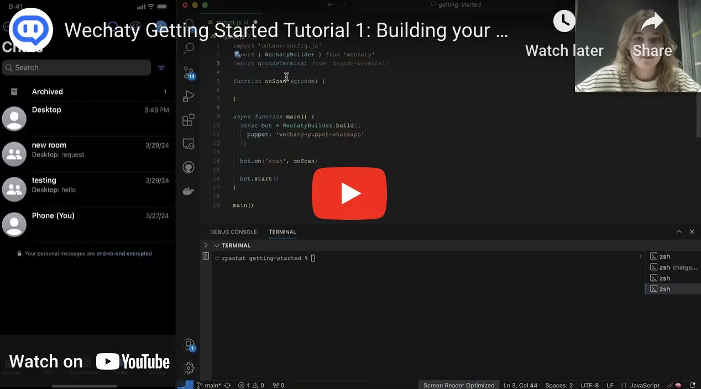

<!-- MDX import -->
import PolyglotBadges   from '../polyglot/transclusions/badges.mdx'
import ProviderBadges   from '../puppet-providers/transclusions/badges.mdx'
import ServiceBadges    from '../puppet-services/transclusions/badges.mdx'

<!-- Pushes a curious reader through the first few minutes of use. -->

If you are a total beginner to Wechaty, start from this section.

You can run Wechaty on following platforms:

- [Google Cloud Shell](../quick-start/running-on-google-cloud-shell.md)
- [Gitpod](../quick-start/running-on-gitpod.md)
- [Locally on your machine](getting-started/running-locally.mdx)

Wechaty is a RPA (Robotic Process Automation) SDK for Chatbot Makers which can help you create a bot in 6 lines of [JavaScript](https://GitHub.com/Wechaty/wechaty), [Python](https://GitHub.com/Wechaty/python-wechaty/), [Go](https://GitHub.com/Wechaty/go-wechaty/), and [Java](https://GitHub.com/Wechaty/java-wechaty/), with cross-platform support including [Linux, Windows, MacOS](https://github.com/wechaty/wechaty/actions?query=workflow%3ANPM), and [Docker](https://github.com/wechaty/wechaty/actions?query=workflow%3ADocker).

You can also watch the [video series](https://www.youtube.com/watch?v=cZd42xxaTcI&list=PLkLKftrhFi7vfaADtPrGyuutbpcA_ppxE) below to get an introduction and demonstration of some of the capabilities and applications using Wechaty's getting-started repository.

In the getting-started tutorials, you will learn the following fundamental features of Wechaty:

- Turn different instant messaging (IM) systems (such as WeChat, WeCom, Whatsapp, Lark, Gitter, and TikTok) accounts into chatbots.
- Work out of the box on Linux, Mac and Windows.
- Supports all [puppets](../puppet-services/overview.mdx) like WeChat, WhatsApp, WeCom, Lark and so on.
- Reply with a `dong` message when it receives a `ding` message.
- Receive and accept friendship requests.
- Create group chats and add/remove users.
- Send files, URLs, and contact cards.

:::note RPA for Instant Messaging Software

Wechaty RPA supports [WeChat](puppet-providers/wechat.md), [Whatsapp](puppet-providers/whatsapp.md), [WeCom](../puppet-services/wxwork.md), [Gitter](puppet-providers/gitter.md), [Lark](puppet-providers/lark.md) and almost all popular IMs. Learn more from our  [Wechaty Puppet Providers](puppet-providers/overview.mdx):

<ProviderBadges />

And [Wechaty Puppet Services](../puppet-services/overview.mdx):

<ServiceBadges />

:::

:::note Multi-languages Programming

<!--
Issue #707
  https://github.com/wechaty/wechaty.js.org/issues/707

FIXME: Gott -> Go
-->
Wechaty SDK supports [TypeScript](../polyglot/typescript/overview.md), [Python](../polyglot/python/overview.md), [.NET](../polyglot/dotnet/overview.md), [Gott](../polyglot/go/overview.md), [Rust](../polyglot/rust/overview.md), and almost all popular programming languages. It also supports [RESTful API](../polyglot/openapi/overview.mdx) & [gRPC](https://github.com/wechaty/grpc) out-of-the-box. Learn more from our [Polyglot Wechaty](polyglot/overview.mdx):

<PolyglotBadges />

:::

## Contact Us

You can [join our Gitter](https://gitter.im/wechaty/wechaty) network if you aren’t already a member.
